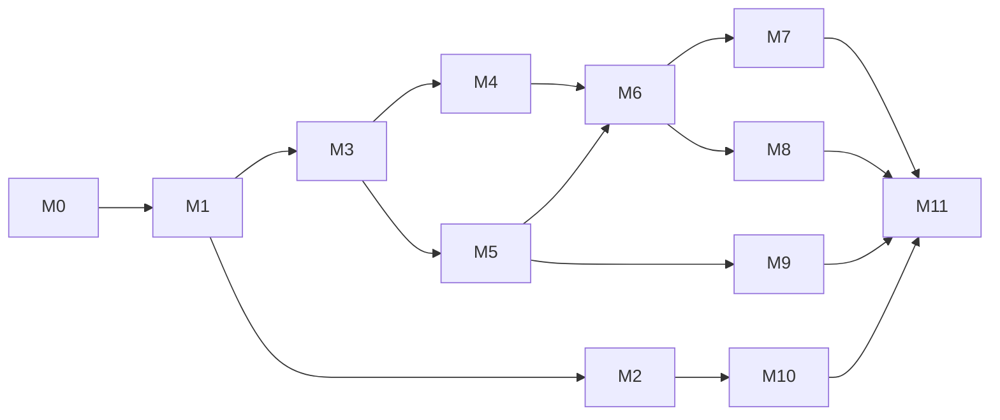

# 01 · 里程碑路线图

11 个里程碑沿同一条业务线 (台湾电商文案) 推进。每个里程碑文档结构统一：

1. 学习目标
2. 关键概念
3. 要写的代码 (含目录与文件)
4. 业务表现 (具体跑出来什么样)
5. UI 增量 (该里程碑给 Web UI 加什么面板/按钮, 详细规格见 [06-ui.md](06-ui.md))
6. 验收标准
7. 进阶练习
8. 推荐档位 (S / M / L / XL，见 [04-local-model-stack.md](04-local-model-stack.md))

## 总表

| # | 名称 | 核心概念 | 业务里的形态 | UI 增量 | 推荐档 |
|---|------|---------|-------------|---------|-------|
| [M0](milestones/m0-skeleton.md) | 项目骨架 + 本地 LLM Client + Web 脚手架 | OpenAI 兼容 client、配置 / 超时 / 重试 / 流式、`cmd/web` 框架 | `cmd/chat` 一来一回；`cmd/web` 起服可访问 Chat 页面 | Chat 单轮 SSE + 左侧导航占位 | S/L |
| [M1](milestones/m1-chat-loop.md) | 多轮对话 + Prompt 工程 | system/user/assistant、上下文窗口、token 预算、流式 | "电商文案助理"角色卡，多轮收集 SKU 信息 | 会话列表 / 切换 / 重置 / 摘要触发提示 | S/L |
| [M2](milestones/m2-tool-calling.md) | Tool Calling (原生 function call) | tool schema、parallel calls、结果回填 | `product_lookup` / `price_format` / `platform_lint` | 消息流中折叠 tool call/observation；右侧 Tools 面板 | L (S 做对照) |
| [M3](milestones/m3-react.md) | 手写 ReAct Loop | Thought-Action-Observation、解析失败兜底 | 自写 JSON 协议 ReAct | Thought 步骤可折叠展示 | S/L |
| [M4](milestones/m4-memory.md) | 记忆 (短期 + 长期) | 滑窗、摘要、KV、SQLite | 跨会话记忆品牌口吻 | 会话/记忆持久化, 可在 UI 浏览 KV | L |
| [M5](milestones/m5-rag.md) | RAG 检索增强 | embedding、chunking、rerank、citation | 检索平台规范 + SKU | 搜索框 + 命中片段查看; citation 高亮 | L |
| [M6](milestones/m6-planner.md) | Planner-Executor | plan-and-solve、DAG、replan | "上新一个 SKU" 拆解链路 | Plan 面板: DAG + 任务状态实时刷新 | L/XL |
| [M7](milestones/m7-multi-agent.md) | Multi-Agent 协作 | 4 角色、消息总线、终止条件 | 4 角色协作产出文案 | Multi 面板: 4 列消息流 + round 编号 | L/XL |
| [M8](milestones/m8-hitl.md) | Human-in-the-Loop | 中断点、approval、resume | 越权/风险时暂停等审批 | Approvals 面板: 待办列表 + 详情 + diff + 一键 approve/reject/edit | L |
| [M9](milestones/m9-observability-eval.md) | 可观测性 + 评测 | trace、judge、回归集 | agent 级评测报告 | Traces 面板: 时间线 + span 详情 JSON | L |
| [M10](milestones/m10-model-routing.md) | 模型路由 | 标签 / ctx / fallback / A·B | 多模型分工 | Router 面板: 命中柱图 + fallback 链 | L (XL 加分) |
| [M11](milestones/m11-capstone.md) | Capstone 综合 agent | 整合 M0–M10 | 输入 SKU 输出多平台文案 + 评测报告 | Capstone 一页串起 Plan/Multi/HITL/Trace/Router | L/XL |

## 依赖关系

- M2 与 M3 互为对照 (原生 function call vs. 自写 ReAct)，建议两个都做。
- M9 (可观测 + 评测) 思想贯穿全程，正式落地放在 M5 之后；之前的里程碑只做最小日志。
- M8 (HITL) 可以在 M6 之后任意时点接入，并不卡住主线。
- M10 (路由) 必须在 M2 已具备多模型连通能力之后做。

## 推进节奏建议

- **第 1 周**：M0 → M1 → M2/M3。打通本地推理 + 工具调用两条路径。
- **第 2 周**：M4 → M5。开始有"状态"和"知识"。
- **第 3 周**：M6 → M7 → M8。从单 agent 走向多 agent 与 HITL。
- **第 4 周**：M9 → M10 → M11。工程化收尾，做 Capstone。

节奏只是参考；每个里程碑文档里给出的"最小可交付"才是硬性目标。
