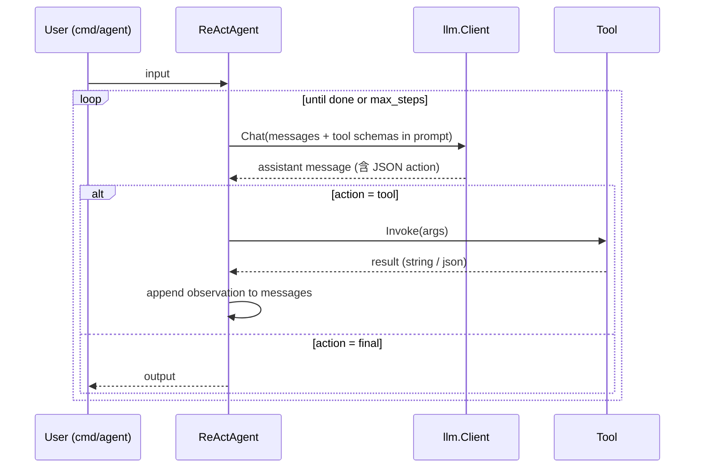

# 02 · 架构

## 设计原则

1. **小接口 + 多实现**：每一层只暴露最小接口，便于在里程碑里逐步替换实现。
2. **协议解耦**：模型层用 OpenAI 兼容协议，agent 层对推理后端无感。
3. **状态显式化**：会话、记忆、approval、trace 全部落 SQLite，单文件可见可回放。
4. **CLI 与 Web UI 并列**：每个里程碑都有一个 CLI 子命令做脚本/测试入口，并在 Web UI 中获得一个面板做演示入口；二者共用 `internal/*`。

## 分层

```
┌────────────────────────────────────────────────────────┐
│ cmd/*                                                  │
│   chat / agent / plan / eval / route / capstone ...    │
├────────────────────────────────────────────────────────┤
│ web layer (cmd/web 内部)                               │
│   handlers / templates / static (embed.FS) / SSE       │
├────────────────────────────────────────────────────────┤
│ agent layer                                            │
│   Agent / Loop / ReActAgent / PlannerAgent / MultiAgent│
├────────────────────────────────────────────────────────┤
│ tool layer                                             │
│   Tool / Registry / 电商工具 / 通用工具                │
├────────────────────────────────────────────────────────┤
│ memory + store layer                                   │
│   ShortTerm / Summarizer / KV / Vector / SQLite        │
├────────────────────────────────────────────────────────┤
│ llm layer                                              │
│   LLMClient / openai-compatible / Router / Embedder    │
└────────────────────────────────────────────────────────┘
```

横切关注点：`config` / `trace` / `hitl` / `errors`。

## 计划中的代码目录 (本轮不创建，按里程碑推进时落地)

```
agent-lab/
├── cmd/
│   ├── chat/                  # M0/M1
│   ├── agent/                 # M2/M3
│   ├── plan/                  # M6
│   ├── multi/                 # M7
│   ├── eval/                  # M9
│   ├── route/                 # M10
│   ├── capstone/              # M11
│   └── web/                   # M0 起, 每个里程碑增量挂面板
├── internal/
│   ├── llm/
│   │   ├── client.go          # LLMClient 接口
│   │   ├── openai.go          # openai-compatible provider
│   │   ├── embed.go           # Embedder
│   │   └── router.go          # M10
│   ├── agent/
│   │   ├── agent.go           # Agent 接口
│   │   ├── react.go           # M3
│   │   ├── planner.go         # M6
│   │   ├── multi.go           # M7
│   │   └── bus.go             # M7 消息总线
│   ├── tools/
│   │   ├── tool.go            # Tool 接口 + Registry
│   │   ├── product_lookup.go
│   │   ├── price_format.go
│   │   ├── platform_lint.go
│   │   ├── slang_check.go
│   │   ├── http_get.go
│   │   ├── calc.go
│   │   └── sqlite_query.go
│   ├── memory/
│   │   ├── shortterm.go
│   │   ├── summarizer.go
│   │   ├── kv.go
│   │   └── vector.go          # M5 sqlite-vec
│   ├── store/
│   │   ├── sqlite.go
│   │   └── migrations.go
│   ├── config/
│   │   └── config.go          # env + yaml + profile (S/M/L/XL)
│   ├── trace/
│   │   └── trace.go           # M9
│   ├── hitl/
│   │   └── approval.go        # M8
│   └── web/
│       ├── server.go          # http.Server + 路由 (M0)
│       ├── handlers_chat.go   # /chat + /api/chat (M0/M1)
│       ├── handlers_tools.go  # /tools (M2 起)
│       ├── handlers_plan.go   # /plan (M6)
│       ├── handlers_multi.go  # /multi (M7)
│       ├── handlers_hitl.go   # /approvals (M8)
│       ├── handlers_trace.go  # /traces (M9)
│       ├── handlers_router.go # /router (M10)
│       ├── templates/         # html/template
│       └── static/            # css / js / svg
├── data/
│   ├── products/              # 5–10 个手写 SKU JSON
│   ├── platform_rules/        # 蝦皮 / momo / 小红书台湾 规则文档
│   └── eval/                  # M9 评测集
├── docs/                      # 设计文档 (本轮)
└── go.mod / go.sum
```

`agent-lab` 复用根目录已存在的 `go.mod` (`module ai-learn-playground`)，包路径形如 `ai-learn-playground/agent-lab/internal/...`。

## 关键抽象

### llm 层

```go
// internal/llm/client.go
type Message struct {
    Role       string         // "system" | "user" | "assistant" | "tool"
    Content    string
    ToolCalls  []ToolCall     // assistant 发出的工具调用
    ToolCallID string         // role=tool 时关联的调用 id
    Name       string         // 可选: tool 名称 / 多 agent 角色
}

type ChatRequest struct {
    Model       string
    Messages    []Message
    Tools       []ToolSchema   // 见 tool 层
    Temperature float32
    MaxTokens   int
    Stream      bool
    Stop        []string
    Extra       map[string]any // 后端特定参数
}

type ChatResponse struct {
    Message    Message
    Usage      Usage          // prompt / completion / total tokens
    FinishReason string       // "stop" | "tool_calls" | "length" | ...
}

type LLMClient interface {
    Chat(ctx context.Context, req ChatRequest) (ChatResponse, error)
    ChatStream(ctx context.Context, req ChatRequest) (<-chan StreamChunk, error)
}

type Embedder interface {
    Embed(ctx context.Context, model string, input []string) ([][]float32, error)
}
```

- 默认实现 `openai.Client` 命中 `OPENAI_BASE_URL` + `OPENAI_API_KEY` (本地为占位字符串)。
- M10 引入 `Router`，按 `model` 名 / 任务标签把请求路由到不同 base URL。

### tool 层

```go
// internal/tools/tool.go
type ToolSchema struct {
    Name        string
    Description string
    Parameters  json.RawMessage // JSON Schema
}

type Tool interface {
    Schema() ToolSchema
    Invoke(ctx context.Context, args json.RawMessage) (string, error)
}

type Registry struct { /* ... */ }
func (r *Registry) Register(t Tool)
func (r *Registry) Resolve(name string) (Tool, bool)
func (r *Registry) Schemas() []ToolSchema
```

- 工具的输入输出全部 JSON 化，便于打 trace 与回放。
- 错误信息**显式回填给模型**，不抛断流程；这样模型有机会自我修正。

### agent 层

```go
// internal/agent/agent.go
type Step struct {
    Thought    string
    ToolCalls  []llm.ToolCall
    ToolResults []ToolResult
    Output     string  // 最终回复 (非空表示终止)
}

type Agent interface {
    Run(ctx context.Context, input string) (string, []Step, error)
}
```

- M2 的 agent 直接走原生 function call；M3 的 `ReActAgent` 用自定义 JSON 协议从零驱动。
- M6 `PlannerAgent`：先让 LLM 产出一个 `Plan` (DAG)，再交给 `Executor` 串行/并行跑。
- M7 `MultiAgent`：N 个 sub-agent + 一个 `MessageBus` + 终止条件 (轮次上限 / 评审通过)。

### memory + store

- `ShortTerm`：环形 buffer，按 token 估算裁剪。
- `Summarizer`：当 buffer 越界，调 LLM 把最旧若干轮压成 1 段 summary。
- `KV`：键值长期记忆，按 namespace (例如 `seller:{id}:tone`) 分区。
- `Vector`：M5 起接 `sqlite-vec`；接口与底层引擎解耦，未来切 pgvector 不动调用方。
- `store/sqlite.go`：单一 `agent.db`，所有持久状态都进这里 (会话 / approval / trace / vector)。

### 横切

- `config`：读 `AGENTLAB_PROFILE=S|M|L|XL`，覆盖默认模型与上下文窗口。可被环境变量逐项覆写。
- `trace`：M9 起，所有 LLM 调用 / 工具调用 / agent step 都打 span，落 SQLite，可由 `cmd/eval` 回放。
- `hitl`：M8，agent 在敏感节点写一条 pending approval，等 CLI 输入后继续。

## 数据流：一次 ReAct 调用



## 配置与档位

档位决定了**默认模型**与**上下文窗口**，不决定代码路径。代码看到的永远是 `cfg.Models.Chat`、`cfg.Models.Embed` 等抽象字段。

```yaml
# 示例: agent-lab/config/profile.l.yaml (M0 起按需创建)
profile: L
models:
  chat: qwen2.5-7b-instruct
  embed: bge-m3
  small: qwen2.5-3b-instruct      # M10 起用
  large: qwen2.5-14b-instruct     # M10 起用
context:
  max_tokens: 8192
  reserve_for_response: 1024
backend:
  base_url: http://127.0.0.1:8080/v1
  api_key: sk-local
```

完整档位定义见 [04-local-model-stack.md](04-local-model-stack.md)。

## Web 层 (cmd/web)

- **HTTP server**：标准库 `net/http` + `ServeMux`。
- **模板**：`html/template`，资源走 `embed.FS`，单二进制可分发。
- **流式**：用 SSE (`text/event-stream`) 把 `LLMClient.ChatStream` 的 chunk 转发给浏览器；浏览器侧用 `EventSource`。
- **取消语义**：HTTP request 的 `Context()` 取消 → 透传给 `ChatStream` → backend 中断生成。
- **状态层**：会话/审批/trace 都走 `internal/store` (SQLite, M4 起)；M0 阶段会话落内存。
- **CLI 复用**：`cmd/web` 不引新业务逻辑，所有能力通过 `internal/*` 与 CLI 共享。

完整路由表与里程碑增量见 [06-ui.md](06-ui.md)。
